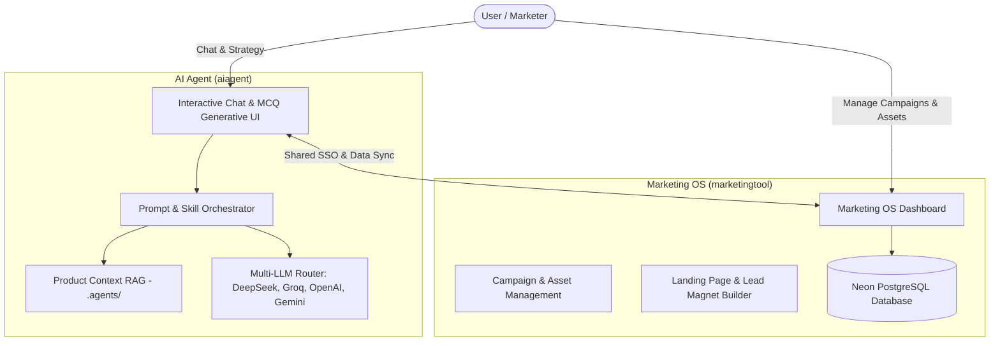

# 🚀 AI Marketing Suite

An open-source, enterprise-grade AI Marketing Suite combining an **Interactive Multi-Agent AI System** (`aiagent`) and a **Full-Featured Marketing OS Platform** (`marketingtool`).

Built for modern growth teams, founders, and marketing agencies who want deep product-grounded AI content generation, multi-channel campaign planning, automated SEO skills, lead generation, and multi-model LLM orchestration.

---

## 🌟 Architecture Overview

The suite consists of two deeply integrated Next.js applications:

```
ai-marketing/
├── aiagent/          # Interactive Multi-Agent AI Workspace & Skills Engine
└── marketingtool/    # Full Marketing OS (Campaigns, Assets, Landing Pages, Leads)
```



---

## 🔥 Key Features

### 1. `aiagent` — Multi-Agent AI Engine & Chatbot
- **Product-Grounded RAG (`.agents/`):** Contextually loads product specifications, value props, target buyer personas, and brand voice guidelines.
- **30+ Specialized Marketing Skills:** Automated skill agents for Brand Strategy, SEO Content Briefs, Ad Copy, AEO (AI Engine Optimization), Competitor Analysis, E-E-A-T Scoring, Schema Markup, and Market Entry.
- **Multi-LLM Support:** Seamless model switching between DeepSeek, OpenAI, Groq, Qwen, and Gemini.
- **Generative UI:** Interactive `<mcq>` multi-choice questionnaires dynamically rendered in the chat flow.
- **Web Research:** Integrated live web search (SearXNG & Jina Reader).

### 2. `marketingtool` — Marketing Operating System
- **Campaign Management:** Full campaign lifecycle tracking with objectives, targets, and attached AI assets.
- **AI Content Studio:** 11+ structured content generation pipelines (blogs, social threads, email drips, ad sets).
- **Landing Page & Lead Magnet Engine:** Drag-and-drop landing page section builders and gated lead magnets.
- **Asset Hub & Storage:** Cloudinary-backed direct uploads with visual asset managers.
- **Analytics & Lead Tracking:** Real-time lead capture, view counts, and engagement metrics.

---

## 🛠️ Quick Start & Setup

### Prerequisites
- Node.js 18+
- PostgreSQL database (Local or Neon PostgreSQL)

### 1. Clone & Install Dependencies

```bash
# Clone the repository
git clone https://github.com/your-username/ai-marketing-suite.git
cd ai-marketing-suite

# Install dependencies for both projects
cd aiagent && npm install
cd ../marketingtool && npm install
```

### 2. Configure Environment Variables

Copy the example environment files in both folders:

```bash
# In aiagent directory
cp .env.example .env

# In marketingtool directory
cp .env.example .env
```

Edit `.env` in both folders with your database URIs and API keys (DeepSeek, OpenAI, Groq, Cloudinary, etc.).

### 3. Database Migration & Seed

```bash
cd marketingtool

# Run Prisma migrations
npx prisma db push

# Seed demo product projects (Acme SaaS, EduSpark, ArtisanCraft)
node prisma/seed-projects.mjs
```

### 4. Run Development Servers

Run `aiagent` and `marketingtool` concurrently in two separate terminal tabs:

```bash
# Tab 1: AI Agent (runs on http://localhost:3000)
cd aiagent && npm run dev

# Tab 2: Marketing OS (runs on http://localhost:3001)
cd marketingtool && npm run dev
```

---

## 📁 Customizing Product Knowledge (`.agents/`)

You can add your own product knowledge so the AI agent generates 100% accurate, product-specific marketing copy!

Create a folder under `.agents/<your-product-key>/`:

```
.agents/
└── your-product-key/
    ├── product.md            # Target audience, features, pricing, value prop
    └── brand-guidelines.md   # Tone of voice, formatting rules, prohibited terms
```

---

## 📄 License

This repository is released under the [MIT License](LICENSE).
