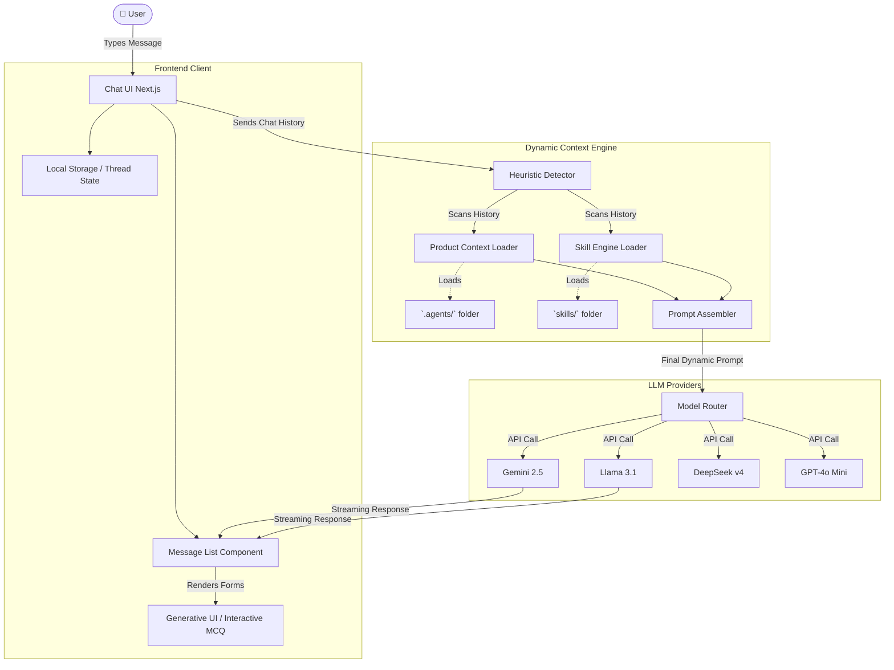

# AiAgent: System Architecture & Workflow

This document explains the complete architecture and workflow of the AiAgent Marketing Agent application. It is designed to be easily explained to developers, stakeholders, and product managers.

## 🏗 High-Level Architecture

The application is built on a **Next.js** framework with a custom-built chat interface. Unlike traditional chatbots that use a single static prompt, this system uses a **Dynamic Context Engine**. The AI's brain (the system prompt) is dynamically assembled on every single keystroke based on the conversation history, the active product, and the active marketing skill.

---

## ⚙️ How the Workflow Operates (Step-by-Step)

### 1. User Input & Local State

When the user types a message in the chat UI (`chat-view.tsx`), the application appends the message to the current thread. The thread and chat history are saved instantly to the browser's `localStorage` (via `threads.ts`) so the user never loses their progress.

### 2. The Heuristic Context Detector

Before sending the request to the AI model, the application intercepts the chat history and runs it through the **Detector** (`marketing-prompt.ts`).

- **Backwards Scanning:** The detector reads the chat history _backwards_ (from newest to oldest).
- **Product Detection:** It scans for predefined keywords (like `acme`, `eduspark`, `artisancraft`). If it finds a match, it instantly stops scanning and loads the massive markdown file for that specific product from the `.agents/` folder.
- **Skill Detection:** It does the same for marketing skills. If it detects words like "competitor", "seo", or "ads", it loads the relevant `SKILL.md` file from the `skills/` directory.

### 3. Prompt Assembly

The application takes the base persona ("You are an elite AI Marketing Agent..."), appends the specific product data, and appends the specific skill instructions. This means the AI is _always_ perfectly context-aware without wasting thousands of tokens loading every single skill at once.

### 4. Model Routing

The user can select which LLM brain they want to use from a dropdown in the UI. The application routes the finalized prompt and the chat history to the specific API handler (`gemini.ts`, `deepseek.ts`, `groq.ts`, etc.).

### 5. Generative UI & Client Rendering

The AI streams its response back to the client (`message-list.tsx`).

- **Standard Markdown:** Normal text, tables, and lists are rendered smoothly using the `Streamdown` component.
- **Interactive Elements (Generative UI):** If the AI decides it needs structured information (like a questionnaire), it wraps a JSON object in `<mcq>` tags. The frontend intercepts these tags, hides the raw text, and dynamically renders the `<InteractiveMcq>` React component (radio buttons, text inputs). When the user clicks "Submit", the UI automatically writes a new message as the user and triggers step 1 again!

---

## 🧠 Core Components Explained

### 1. The Skills System (`aiagent/skills/`)

This is the "Capabilities" layer. Instead of the AI knowing a little bit about everything, it becomes an absolute expert at one thing at a time. The skills include `product-research`, `ai-seo`, `marketing-ideas`, etc. Each skill defines its own tools, expected outputs, and frameworks (like ICE scoring or AARRR funnels).

### 2. The Product Identity System (`.agents/`)

This is the "Knowledge" layer. Markdown files in `.agents/<productKey>/product.md` act as the AI's memory of your actual business. It contains your target audience, monetization strategies, feature sets, and competitors.

### 3. Generative UI (The `<InteractiveMcq>` component)

This transforms the AI from a simple "chatbot" into an interactive software application. Instead of asking you to type out a list of answers, the AI generates actual UI buttons and forms on the fly, dramatically improving the user experience.

---

## 🎯 Summary for Stakeholders

> **"AiAgent is not just a chatbot; it is a modular, context-aware Marketing Engine."**

It behaves like a real employee:

1. **It listens** to what you want to achieve.
2. **It fetches the right manual** (Skills) for the job.
3. **It looks up the company handbook** (Product Knowledge) to ensure the strategy matches your actual business.
4. **It uses the best brain** (LLM Routing) to generate the strategy.
5. **It builds its own tools** (Generative UI) to interact with you efficiently.
